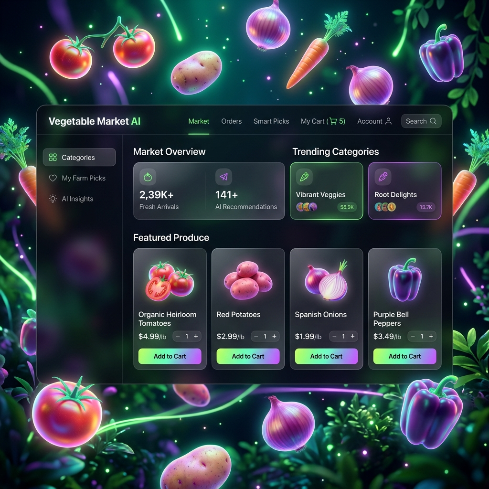

# 🥬 Vegetable Market AI — 3D Interactive Experience

[](https://nodejs.org/)
[](https://threejs.org/)
[](https://www.mysql.com/)
[](https://opensource.org/licenses/MIT)



> **Experience the future of grocery shopping.** This isn't just a market; it's a **"Vegetable Party"** where high-fidelity 3D procedural models meet a premium glassmorphism interface.

---

## 🌟 Key Features

### 🎮 Immersive 3D Experience
- **Bioluminescent Environment**: A stunning full-screen 3D scene built with **Three.js**.
- **Procedural Vegetables**: Over 20+ custom 3D models (Potato, Tomato, Onion, etc.) with unique animations.
- **Interactive Feedback**: Vegetables glow and scale on hover; clicking them triggers real-time data fetching.

### 💎 Premium Design System
- **Dark Glassmorphism**: High-fidelity UI using semi-transparent "frosted glass" elements (`backdrop-filter`).
- **Neon Aesthetic**: Vibrant green and purple accents for a modern, futuristic feel.
- **Micro-Animations**: Smooth transitions and hover effects powered by modern CSS and GSAP.

### 🔐 Enterprise-Grade Backend
- **Role-Based Access**: Specialized dashboards for **Admins** and **Employees**.
- **Live Inventory**: Transactional stock management with MySQL to prevent oversales.
- **Secure Auth**: JWT-based authentication with BCrypt password hashing.

---

## 🛠️ Tech Stack

| Layer | Technologies |
| :--- | :--- |
| **Frontend** | HTML5, CSS3 (Glassmorphism), Vanilla JS (ES6+) |
| **3D Engine** | **Three.js**, Custom Procedural Geometry |
| **Backend** | Node.js, Express.js |
| **Database** | MySQL (with `mysql2` & Promises) |
| **Security** | JWT, BCrypt, CORS, Dotenv |

---

## 🚀 Getting Started

### 1. Prerequisites
- **Node.js** (v18 or higher)
- **MySQL** (Running locally or via Docker)

### 2. Installation
```bash
# Clone the repository
git clone https://github.com/Rushigit1520/vegetable-market-ai.git

# Navigate to project
cd vegetable-market-ai

# Install dependencies
npm install
```

### 3. Database Configuration
Create a `.env` file in the root directory:
```env
DB_HOST=localhost
DB_USER=root
DB_PASS=your_password
DB_NAME=veg_market_db
JWT_SECRET=super_secret_key
PORT=3000
```

### 4. Initialization
Seed the database with the interactive product catalog:
```bash
npm run seed
```

### 5. Launch
```bash
npm start
```
Open **[http://localhost:3000](http://localhost:3000)** to enter the party!

---

## 📂 Project Structure

```text
├── config/             # Database connection & seed scripts
├── data/               # Product JSON & static data
├── middleware/         # JWT & Auth validation
├── public/             # Frontend assets
│   ├── assets/         # UI Mockups & Images
│   ├── css/            # Glassmorphism & Layout styles
│   ├── js/             # Three.js scene & Main logic
│   └── *.html          # UI Pages (Index, Login, Admin)
├── routes/             # API Endpoints (Auth, Products, Cart)
├── server.js           # Express Entry Point
└── README.md           # This file!
```

---

## 🔐 Default Credentials

| Role | Email | Password |
| :--- | :--- | :--- |
| **Admin** | `admin@freshcart.com` | `admin123` |
| **Employee** | `employee@freshcart.com` | `emp123` |

---

## 👤 Credits

Developed with ❤️ by **Rushigit1520** using the power of **Antigravity AI**.
